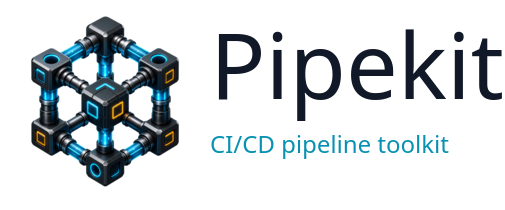

<div align="center">
  
  <p>
    
    
    
  </p>
</div>

**CI/CD pipeline Swiss Army knife** — replace fragile bash one-liners with a single, portable Go binary.

<div align="center">
  
</div>

```bash
# BEFORE                                    # AFTER
for key in $(jq -r 'keys[]' config.json);   pipekit env from-json config.json \
  do                                          --uppercase-keys --to-github
  value=$(jq -r ".[\"$key\"]" config.json)
  echo "${key^^}=$value" >> "$GITHUB_ENV"
done
```

One static binary, no runtime deps, works the same on Linux, macOS, and Windows.

---

## Quick install

```sh
# Linux x86_64
curl -L https://github.com/AxeForging/pipekit/releases/latest/download/pipekit-linux-amd64.tar.gz | tar xz
sudo mv pipekit-linux-amd64 /usr/local/bin/pipekit
```

ARM64, macOS, Windows, source builds → **[docs/INSTALL.md](docs/INSTALL.md)**

---

## 30-second tour

```sh
# Extract JSON config into GITHUB_ENV as UPPER_SNAKE_CASE
pipekit env from-json config.json --flatten --uppercase-keys --to-github

# Fail fast if required vars are missing
pipekit assert env-exists DEPLOY_TOKEN CLUSTER_NAME IMAGE_TAG

# Wait for a service to be ready
pipekit wait url http://localhost:8080/healthz --timeout 150s
pipekit wait grpc localhost:50051 --service my.package.Worker --timeout 60s
pipekit wait ws ws://localhost:8080/events --timeout 60s

# Request an API and extract JSON without curl+jq
pipekit http get https://api.example.com/release --expect-status 200 --jq .tag --raw

# Pack cross-platform release archives
pipekit archive pack dist/app.tar.zst ./bin/app README.md

# Retry a flaky command with exponential backoff
pipekit retry run --attempts 5 --delay 5s --backoff -- helm upgrade --install myapp ./chart

# Notify Slack on success/failure
pipekit notify slack --status success --title "Deploy v1.2.3 to prod"
```

More end-to-end recipes → **[docs/EXAMPLES.md](docs/EXAMPLES.md)**

---

## Commands at a glance

| Command | What it does | Reference |
|---|---|---|
| `env` | Parse JSON / YAML / dotenv into env vars (GITHUB_ENV, GITHUB_OUTPUT, GitLab) | [↗](docs/COMMANDS.md#env) |
| `mask` | Hide secrets in logs (regex patterns, partial reveal, GitHub `::add-mask::`) | [↗](docs/COMMANDS.md#mask) |
| `transform` | base64, URL-encode, case conversion, regex replace, templates, hash, slug | [↗](docs/COMMANDS.md#transform) |
| `summary` | Append markdown / tables / badges / collapsibles to `$GITHUB_STEP_SUMMARY` | [↗](docs/COMMANDS.md#summary) |
| `assert` | Pipeline guards: env vars, files, JSON paths, semver, URL health | [↗](docs/COMMANDS.md#assert) |
| `matrix` | Build GitHub Actions matrix JSON from dirs / files / JSON / Cartesian product | [↗](docs/COMMANDS.md#matrix) |
| `notify` | Slack / Discord / Teams / generic webhook with status formatting | [↗](docs/COMMANDS.md#notify) |
| `wait` | Poll a URL / TCP port / shell command until ready | [↗](docs/COMMANDS.md#wait) |
| `diff` | Detect changed files / dirs / services between git refs (monorepo-friendly) | [↗](docs/COMMANDS.md#diff) |
| `version` | Get / bump / compare versions across `package.json`, `Cargo.toml`, `Chart.yaml`, etc. | [↗](docs/COMMANDS.md#version) |
| `retry` | Run any command with attempt count, delay, backoff, exit-code filtering | [↗](docs/COMMANDS.md#retry) |
| `cache-key` | Deterministic SHA256 cache keys from files / globs / composite parts | [↗](docs/COMMANDS.md#cache-key) |
| `checksum` | Generate / verify release checksums for artifact files | [↗](docs/COMMANDS.md#checksum) |
| `artifact` | Assert artifacts exist and generate size/SHA256 manifests | [↗](docs/COMMANDS.md#artifact) |
| `git` | CI-friendly git metadata: ref, SHA, tags, dirty state | [↗](docs/COMMANDS.md#git) |
| `changelog` | Generate release notes from git commit ranges | [↗](docs/COMMANDS.md#changelog) |
| `config` | Resolve env-specific config maps; map branches to environments | [↗](docs/COMMANDS.md#config) |
| `parse` | Pull fenced code blocks / YAML / frontmatter out of issue bodies, PR comments, markdown | [↗](docs/COMMANDS.md#parse) |
| `comment` | Render, inspect, select, and amend hidden-anchor PR comments | [↗](docs/COMMANDS.md#comment) |
| `json` / `yaml` | Get / set / del / deep-merge / convert / pretty / table on JSON, YAML, TOML, CSV | [↗](docs/COMMANDS.md#json) |
| `render` | Render Go templates with a sprig-like FuncMap and stacked `--values` files | [↗](docs/COMMANDS.md#render) |
| `exec` | Unified retry + mask + tee + timeout command runner | [↗](docs/COMMANDS.md#exec) |
| `url parse` | Split a URL into `SCHEME / HOST / PORT / USER / PASSWORD / PATH / QUERY` env vars | [↗](docs/COMMANDS.md#url) |
| `image parse` | Split a container image ref into registry / repository / tag / digest | [↗](docs/COMMANDS.md#image) |
| `time` | RFC3339 / unix / tag / compact / iso timestamps; format conversion; arithmetic | [↗](docs/COMMANDS.md#time) |
| `port free` · `uuid` · `random` | Tiny generators for ephemeral resource names and ports | [↗](docs/COMMANDS.md#misc) |
| `doctor` | Diagnose CI platform, env-var contract, tool availability | [↗](docs/COMMANDS.md#doctor) |

Full flag reference → **[docs/COMMANDS.md](docs/COMMANDS.md)**

---

## Documentation

| Doc | When to read |
|---|---|
| [INSTALL.md](docs/INSTALL.md) | Install on Linux / macOS / Windows, build from source |
| [REQUIREMENTS.md](docs/REQUIREMENTS.md) | Supported platforms, runtime deps, CI env vars contract |
| [COMMANDS.md](docs/COMMANDS.md) | Full reference: every command, every flag, copy-pasteable examples |
| [EXAMPLES.md](docs/EXAMPLES.md) | End-to-end pipeline recipes (GitHub Actions, GitLab CI, Jenkins) |
| [CONTRIBUTING.md](docs/CONTRIBUTING.md) | Repo layout, adding a command, testing, releasing |
| [AI/README.md](docs/AI/README.md) | Architecture reference for AI assistants working in this repo |

---

## License

MIT — see [LICENSE](LICENSE).
